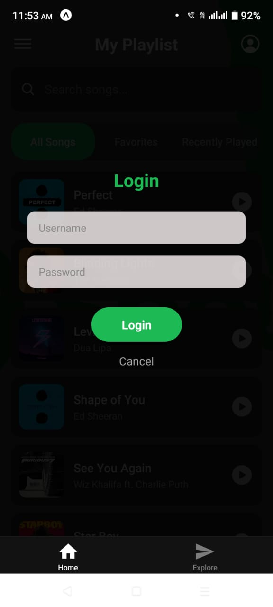
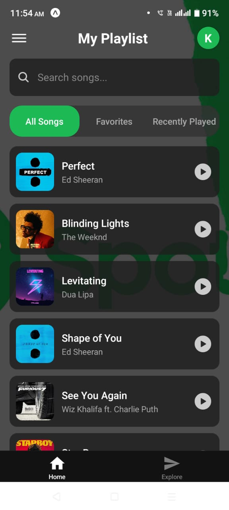

# 📱 To-Do List App (Expo + React Native)

A modern, smooth, and customizable To-Do List application built using **Expo**, **React Native**, and **TypeScript**.  
This app includes animations, drag-and-drop sorting, swipe actions, and a clean UI for managing tasks efficiently.

---

## 🚀 Features

- ✨ Add, edit, and delete tasks  
- 🔄 Drag & drop to reorder items  
- 👆 Swipe to delete or complete tasks  
- 🎨 Beautiful UI with animations  
- 📦 Stores data locally  
- 💯 Built using Expo + React Native + TypeScript  

---

## 📸 Screenshots

### 🖼 App Preview

Place your screenshot in:  

